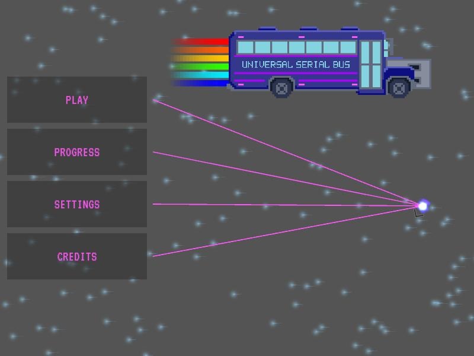
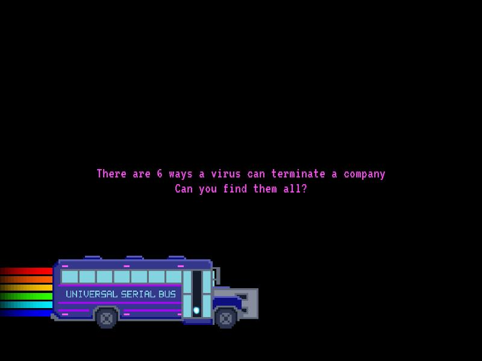
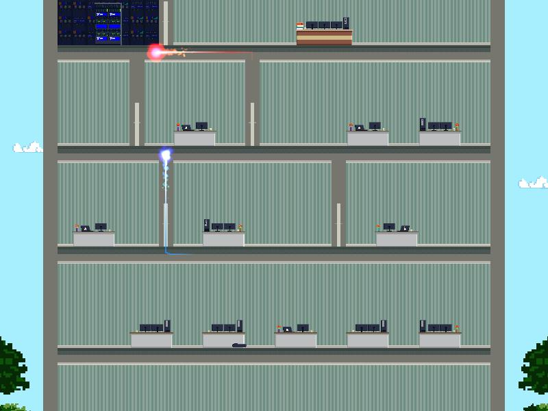
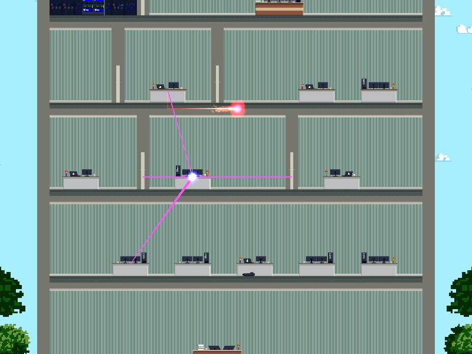

# Universal Serial Bus (USB)
Universal Serial Bus (USB) is a 2D puzzle game where you play as a little virus that got into the reception desk computer through a USB stick.
It's up to you to find all the ways you can use the company's network to shut them down.
Traverse the network, hack IoT devices, snoop data, disturb and fire employees, just be careful of the antivirus that is after you.

This game is a submition for the <a href="https://itch.io/jam/game-off-2021">Github Game Off 2021</a>

  
  
  
  

# How to play
- Use your mouse to select which connection to follow.
- Prompts will show up on every device, showing you possible interactions triggered by <kbd>1</kbd> - <kbd>9</kbd>.
- Hacking into a Roomba will allow you to control its movement using <kbd>A</kbd> and <kbd>D</kbd>

# Technology
The game was built using [Unity 2020.3.19f1](https://unity.com/) and [FMOD Studio 2.01.08](https://www.fmod.com/)
with the additional help of
[DOTween](https://assetstore.unity.com/packages/tools/animation/dotween-hotween-v2-27676),
[48 Particle Effect Pack](https://assetstore.unity.com/packages/vfx/particles/spells/48-particle-effect-pack-13998) and
[2D Pixel Trees](https://assetstore.unity.com/packages/2d/textures-materials/nature/2d-pixel-trees-63479)

# Credits
### Game Design
Alex Asenov,
Georgi Tsaklev,
Reni Mihaylova

### Programming
Georgi Tsaklev

### Mission Design
Georgi Tsaklev,
Vencislav Velkov

### Art
Alex Asenov

### Music & Sound
Alex Asenov

### Menus and UI
Georgi Tsaklev,
Pavel Pavlov
